[](https://creativecommons.org/licenses/by/4.0/)
> [!NOTE]
> Current version : **2.0.0** (read [changelog](#changelog) for details)

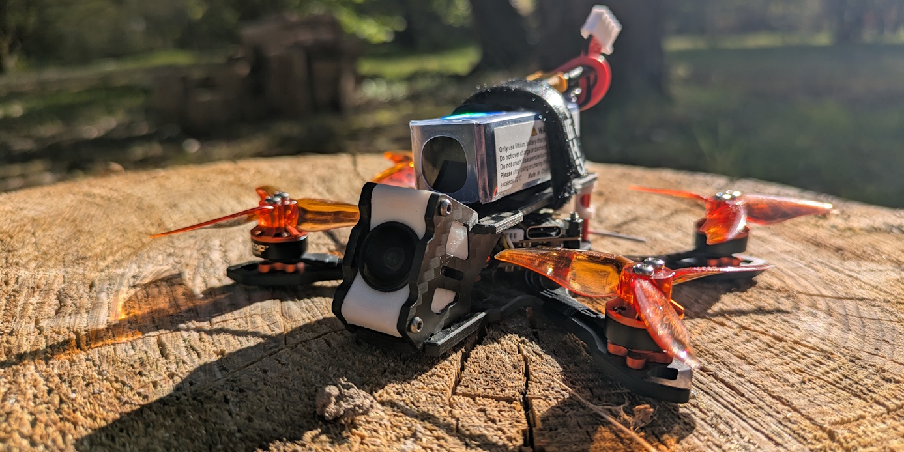

# JeNo Pocket 2.5"
***2.5" drone FPV frame compatible with Air Unit O4 Lite (or any Nano camera), designed for Freestyle, Freeride and Cinematic.***

> [!NOTE]
> Designed in France by members of the [WE are FPV](https://www.wearefpv.fr/) community, the JeNo is already flown by hundreds of pilots and is now being sold by [Drone FPV Racer](https://www.drone-fpv-racer.com/recherche?controller=search&s=JeNo+5.1+frame&aff=64&id_campaign=13) (affiliate link). The French version of the project is available on [Printables](https://www.printables.com/model/1175339-jeno-pocket-drone-frame). Note that a [3-3.5" version](https://github.com/WE-are-FPV/JeNo-3-3.5), a [5.1-6" version](https://github.com/WE-are-FPV/JeNo-5.1) and a [7-8" version](https://github.com/WE-are-FPV/JeNo-7) of the JeNo exist.

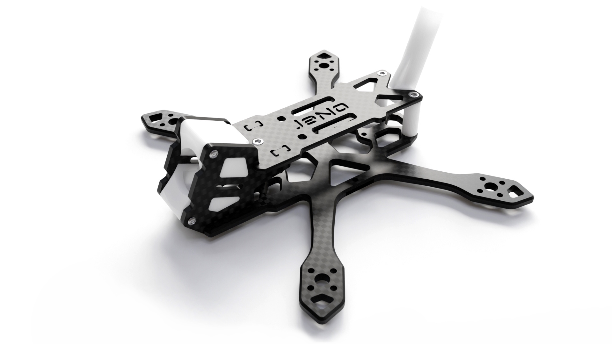

## Table of contents

* [Key features](#key-features)
* [Presentation](#presentation)
* [Detailed specifications](#detailed-specifications)
* [What’s new compared to the V1](#whats-new-compared-to-the-v1)
* [Recommended configuration](#recommended-configuration)
* [Versions and files](#versions-and-files)
* [Get it cut !](#buy-it-or-cut-it-)
* [Bill of materials](#bill-of-materials)
* [Building/Assembly guide](#buildingassembly-guide)
* [Inspiration](#inspiration)
* [Tuning, Betaflight Preset](#tuning-betaflight-preset)
* [Blackbox](#blackbox)
* [Videos](#videos)
* [Builds examples](#builds-examples)
* [Authors](#authors)
* [TPU](#tpu)
* [Community (remixes and TPU)](#community-remixes-and-tpu)
* [Changelog](#changelog)

## Key features
- [x] Perfect integration of the DJI **O4 Lite Air Unit** camera
- [x] Compatible with **O3 lens mods (Khrom’s mod), and O4 Wide lens mods from Flywoo/Runcam**
- [x] **Wide-X** geometry
- [x] Excellent flight **performance**, easy to tune
- [x] **Strong** and **stiff**
- [x] **Frame, standoffs and props are invisible** in the video feed
- [x] **Camera tilt options** : 15, 20, 25, 30 and 35°
- [x] **Bus height options** : 14, 16, 18 and 20 mm
- [x] Designed for: DJI O4 Lite Air Unit (**+ mods**), Walksnail Avatar/Ascent, Artlynk, HDZero and analog setups
- [x] **Easy to build**, ideal for beginners
- [x] LiPo strap slots
- [x] Compatible with flight controllers featuring a vertical USB port (with the “X-Core” and “Tank” versions)
- [x] **Open source**, of course

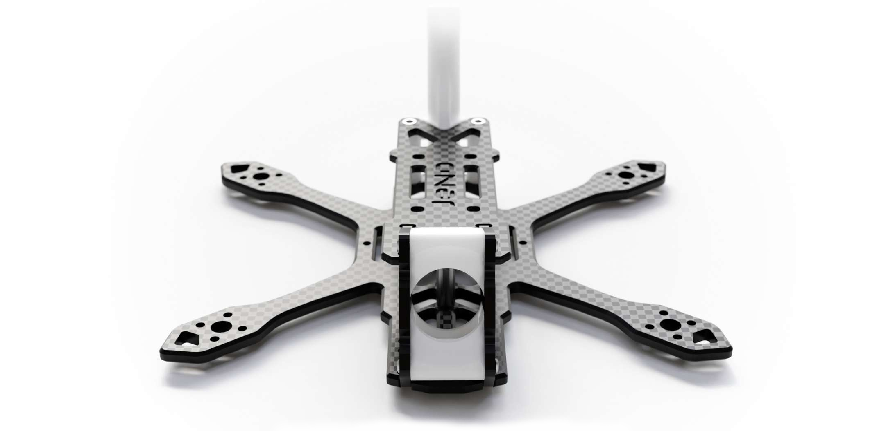

## Presentation
In **2025/2026**, we’ve seen a few interesting new developments in the **HD VTX** world: **lens mods** for the DJI O4 Lite, BetaFPV’s **ArtLynk**, and Caddx’s **Ascent**. These evolutions are especially beneficial for compact drones, starting with the 2.5" format.

We are convinced that **2.5" is becoming a major option in FPV**, just like 5" has been for more than a decade, thanks to its many advantages: durability, discretion, lower risk, compact size, reduced manufacturing and consumable costs, ease of building, and more. It is also probably one of the **best options to get started in FPV** !

Following the success of the [first version of the JeNo Pocket](https://github.com/WE-are-FPV/JeNo-Pocket), and with the arrival of [O3 and O4 Wide lens mods](https://www.youtube.com/watch?v=6qGIw0IEMis), which finally give the **DJI O4 Lite a proper FOV**, we wanted to offer the **ultimate version** of the smallest JeNo. Here’s what’s on the menu for the **JeNo Pocket V2** :

* Updated, modern **design**
* Reinforced **durability**
* Compatibility with O4 Lite **lens mods**
* More options, so every pilot can find the setup that suits them:
  * Camera **tilt** options: 15, 20, 25, 30 or 35°
  * Bus **height** options: 14, 16, 18 or 20 mm
  * **LiPo strap** slots
  * Support for flight controllers with **vertical USB port**

Of course, this V2 keeps everything that defines the **JeNo DNA** :

* Carbon camera cage
* High performance and durability
* Completely clear video feed, with no frame or props in view
* Spacious and easy to build
* Open source

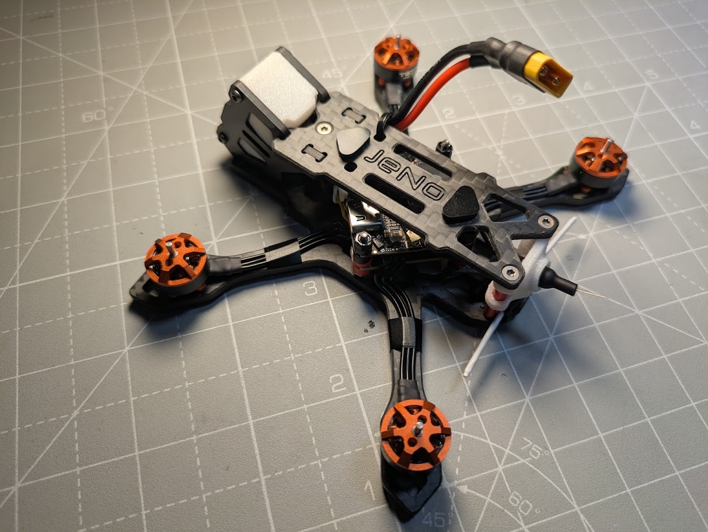

This V2 is heavily inspired by [Cam.Traveler](https://www.printables.com/@Cam_Traveler_2489307)’s [JeNo 25](https://github.com/WE-are-FPV/JeNo-Pocket), which itself was inspired by the [JeNo Pocket](https://www.printables.com/model/1175339-jeno-pocket-drone-frame) and [JeNo Fit 3"](https://github.com/WE-are-FPV/JeNo-Fit-3-3.5). Huge thanks to him for his work and for sharing it. Once again, this shows the benefits of open source, where everyone gets to benefit.

## Detailed specifications

|||
| :--- | :--- |
| **Geometry** | **Wide-X** | 
| **Props size** | 2.5" | 
| **Weight** | **X-Core : 25 g**, **Classic : 27 g**, **Tank : 30 g** (with screws) | 
| **Body height** | 14/16/18/20 mm | 
| **Bottom plate** | 3 mm | 
| **Top plate** | 2 mm | 
| **Camera plates** | 2 mm | 
| **Motors mounting** | 9 mm | 
| **Camera** | 14 mm (Nano), O4 Lite and mods, **Clear FOV**. |
| ** Camera tilt** | 15/20/25/30/35° |
| **Main stack** | 25.5 mm x 25.5 | 
| **Back stack** | RX area. 13 mm x 13 mm | 
| **Supported VTX** | Analogic, **DJI Air Unit O4 Lite (+mods)**, WalkSnail Avatar/AScent, HDZero, ArtLynk… | 
| **Strap passage** | Yes | 

## What’s new compared to the V1

### Redesign and durability

Since the [JeNo Fit 3"](https://github.com/WE-are-FPV/JeNo-Fit-3-3.5), we’ve been trying to move away from the standard stack-area design, with its classic side “spikes”, and adopt **more harmonious shapes** instead. This improves both the look and the **durability**, with wider arm bases that are therefore stronger and more rigid.

Here is an overview of the main differences between the V1 and the V2. The center patterns have been removed for this comparison, so we can focus on the main structure.

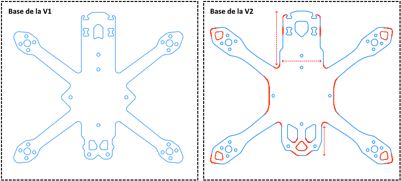

The red areas highlight the main changes. Beyond the **more visually appealing design**, the arms appear shorter — and they actually are! Removing the side spikes in favor of a direct junction between the arms and the bus **significantly reinforces the arms**.

There are also a few other improvements worth highlighting:

* Better **motor protection** at the end of the arms
* **The front** of the bottom plate has been **widened and shortened for better durability**. There is also more material between the slots for the camera plates and the edge of the frame.
* **The rear** has also been shortened
* Mounting support for a T-style antenna
* As we will see later, cutouts are also provided for flight controllers with a **vertical USB port**.

The following image shows an overlay of the V1 and V2 to better illustrate the differences.

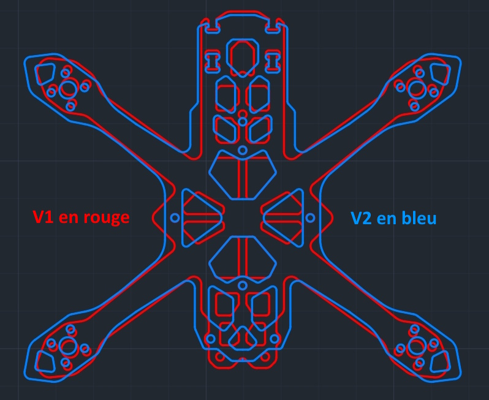

### "À la carte" bottom plate options

We offer **3 versions** of the bottom plate, all based on the improvements mentioned above.

The **V2 “Classic”** bottom plate is the direct evolution of the **V1** : it features a carbon cross in the center, ensuring good rigidity across all axes. Like the V1, it also **does not include** a cutout for flight controllers equipped with a **vertical USB port**.

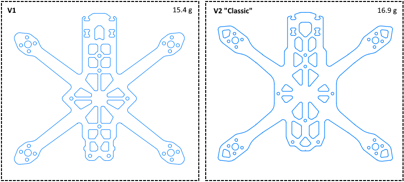

*Two other versions** are also available, both **compatible** with flight controllers equipped with a **vertical USB port** :

* **V2 “X-Core”** : this is the optimized version of the JeNo Pocket V2. Lighter than the “Classic” and more durable than the V1, it is characterized by a **carbon X in the center**, following the diagonals of the arms. **Ideal with lightweight props** such as the Gemfan 2520. It is less tolerant of heavy props that generate a lot of vibrations, such as the Avan Rush.

* **V2 “Tank”** : with its **wider arms** and “solid” carbon layout, this is the **stiffest and most durable** of the 3 versions. We did not call it V2 “Bando” because, in absolute terms, all 3 versions remain strong enough for that kind of flying.

At **4.7 g heavier** than the **“X-Core”** version, it is also **more tolerant** of heavy or high-pitch props during hard full-throttle punches.

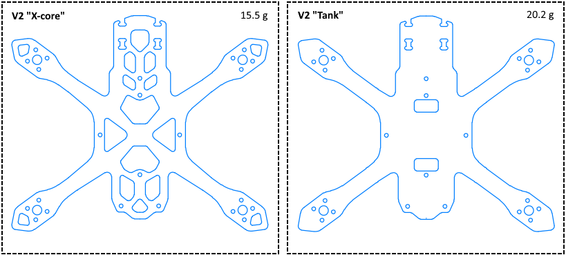

Example build with a flight controller equipped with a vertical USB port:

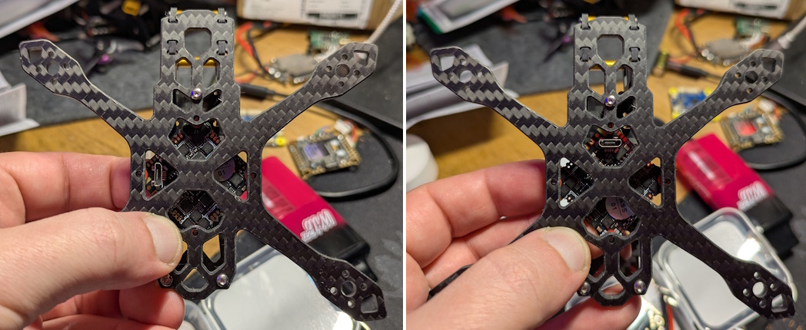

### Customizable camera plates : height and tilt

The **single bus height** of the **V1**, 20 mm, was convenient because it was spacious and even allowed for a Naked Vista build, but some pilots prefer a more **low-profile** bus. It is now possible to **choose the height** :

* **14 mm** : very low-profile, but be careful, the build will be more difficult
* **16 mm** : a good compromise, making the build easier while staying relatively low profile — Nochamo’s preference
* **18 mm** : allows for an easy build without going all the way up to 20 mm — Jérôme’s preference
* **20 mm** : still available for maximum space and Naked Vista compatibility

We recommend the two intermediate versions: 16 or 18 mm.

Camera tilt is now also optional: the camera plates are available in **15, 20, 25, 30 or 35°**.

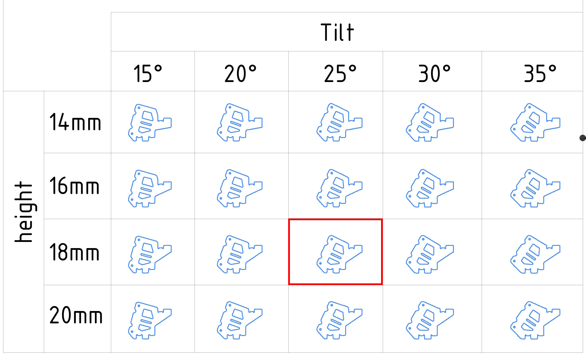

As an example, in the image above, the version highlighted in red is the one to choose for an 18 mm bus height and a 25° camera tilt.

### Top plates

The top plate remains fairly simple, with the addition of **slots for a LiPo strap**.

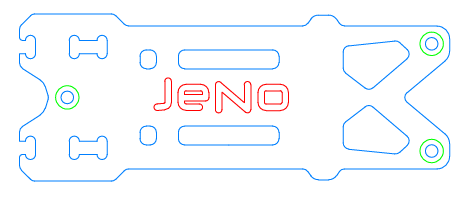

The **two small holes** above and below the “J” are intended to secure the **pigtail** with a **zip tie**.

Given the size of the frame, the “JeNo” engraving is quite fine. If your carbon cutter is not able to machine the logo as a **pocket**, it is still possible to **engrave only the outline** — it also looks very nice.

The space on both sides of the logo can be used to install small **LiPo pads**.


A **reinforced version** of the top plate is also available for the **“Tank”** version.

### Camera mounts

For standard **Nano-sized** cameras, with one screw hole on each side, mounting is done directly through the central rail of the camera plates, allowing you to adjust the camera setback as needed.

| Standard nano camera | O3 Lens Mod |
| :---: | :---: |
| 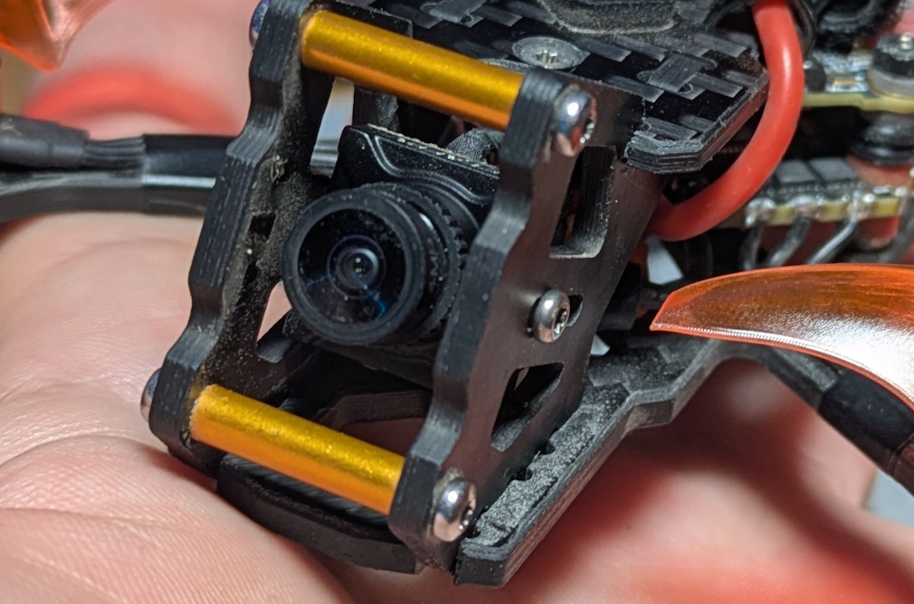 | 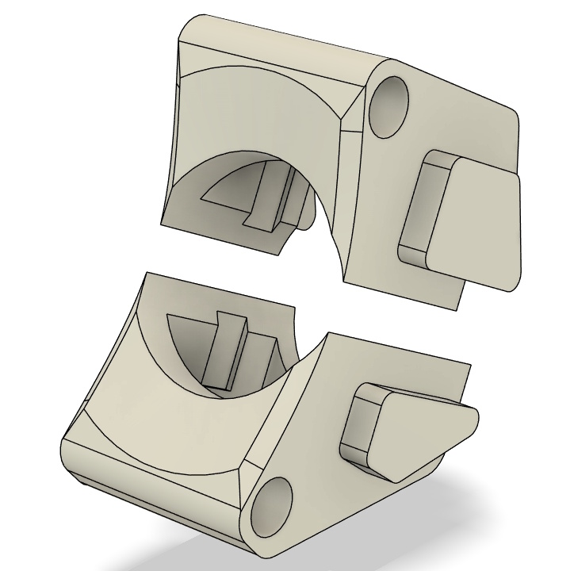 |

For the O4 Lite camera, we designed two-piece TPU mounts that wrap around the camera and are locked in place by the camera plates. Three TPU mounts are available:

A standard version for the unmodified O4 Lite camera
A version for the O3 lens mod — the best conversion currently available
A version for the Flywoo/Runcam O4 Wide lens mod

To get a **fully unobstructed FOV**, move the lens about one millimeter forward past the TPU, as shown in the image above. Conversely, for more protection, you can move the camera very slightly backward, at the cost of very minor vignetting.

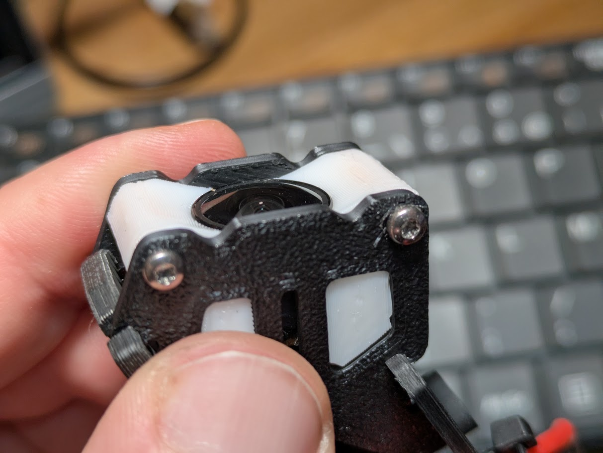

These TPU parts are designed to integrate perfectly with the carbon. However, depending on cutting tolerances and leftover TPU support material, a few small adjustments with flush cutters may be required for the TPU to fit properly.

## Recommended configuration

Different approaches are possible, from ultra-light to mini-rocket, depending on your hardware choices.

### Motors

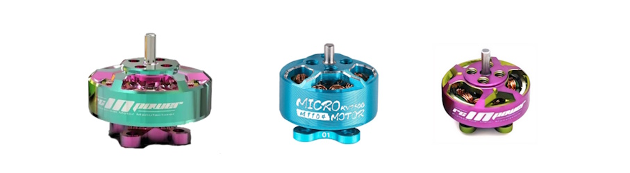

| **Size** | **Stator volume** | **Recommended KV (2S)** | **Recommended KV (3S)** |
| :---: | :---: | :---: | :---: |
| 1202 | 226 mm³ | ~8000 | ~6000 |
| 1103 | 285 mm³ | ~8000 | ~6000 |
| **1203** | **339 mm³** | **~8000** | **~6000** |
| **1104** | **380 mm³** | **~8000** | **~6000** |
| **1303** | **398 mm³** | **~8000** | **~6000** |
| 1204 | 452 mm³ | ~8000 | ~6000 |
| 1105 | 475 mm³ | ~8000 | ~6000 |

2S motors can also be used on 3S thanks to **Betaflight’s Motor Limit** feature. In fact, this is probably the best approach: choosing motors around **7500–8000 KV** allows you to run them on both 2S and 3S.

These small motors, such as the **RCInPower** 1203 8000KV or **BetaFPV** 1104 7500KV, are still quite expensive despite their size. A low-cost option is available from [**YSIDO** with their 1104 7500KV motors](https://fr.aliexpress.com/item/1005005729701162.html), which can usually be found for around €20–25 for a set of 4. For bando flying, they probably won’t be the most durable option, but for freestyle, they do the job very well.

### Lipos

We recommend **2S or 3S lipos** as indicated in the table above, although 4S is also an option.

**2S ~550 mAh** lipos are a good compromise, or **3S ~450 mAh**. For maximum flight time, **3S ~550 mAh** lipos are still perfectly viable.

Small 2S ~450 mAh lipos are possible with a very light setup and small motors, but the impact on flight time and sag may become noticeable.

In any case, we strongly recommend **Dogcom 2S and 3S 560 mAh** lipos, as they have shown the best performance by far.

<p align="center">
  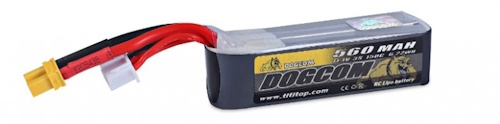
</p>

Depending on the lipos, during a freestyle flight outdoors in cold weather (~5°C), flight times can range from **2 minutes** (BetaFPV 2S 450 mAh) to **5 minutes** (Dogcom 3S 560 mAh)! You can even hope to reach **7 minutes** with a smooth flight using these same lipos.

### Props

We tested many props from **Gemfan, HQ and Emax** for freestyle flying. The props we recommend are the **Gemfan Hurricane 2520-3** and the **HQ 2.5x1.9x3** : light, responsive and precise. They work perfectly with all bottom plate versions and make a perfect combo with the **“X-Core”** version: it is lightweight and flies very well.

The **Emax Avan Rush 2.5"**, along with other heavier or higher-pitch props, are more “brutal” due to their very **unusual profile** and **higher weight**. This is not an issue for freestyle flying, but during sustained full-throttle punches, vibrations may appear on the “X-Core” version. The **“Classic” and “Tank”** versions absorb them well.

[Here is an example of a full-throttle punch followed by freestyle flying](https://youtu.be/E_eKk1bxeOk) in 3S on the **“X-Core”** version with these **Avan Rush 2.5"**, to illustrate the behavior with these props.

We did not want to exclude them from the recommended props for the JeNo Pocket V2 for 3 reasons:

* They are the **most durable props** available. You almost never need to replace them, which is an important point, especially with T-Mount props, which are often tedious to change.
* The vibration issue does not exist on the **“Tank”** version and is anecdotal on the **“Classic”** version.
* On the “X-Core” version, it only appears during full-throttle punches. It is not a deal-breaker, but the Gemfan 2520 simply fly much better.


> [!TIP]
> **Gemfan 2520 →** ideal for **all versions** of the JeNo Pocket V2

> [!TIP]
> **Emax Avan Rush →** we recommend the **“Classic”** or **“Tank”** versions for better flight behavior, especially during full-throttle punches.

### FC, ESCs and RX
Here, you’ll have plenty of choices, as the range is very diverse. The main recommendation is to go for an **FC AiO** with ESCs that can deliver **20A**, to be on the safe side, although theoretically, 15A should be sufficient.

The O4 Lite can be powered **directly from the lipo** if you’re using 2S or 3S. For higher voltages, you'll need an FC with a BEC capable of delivering at least 10W for the O4.

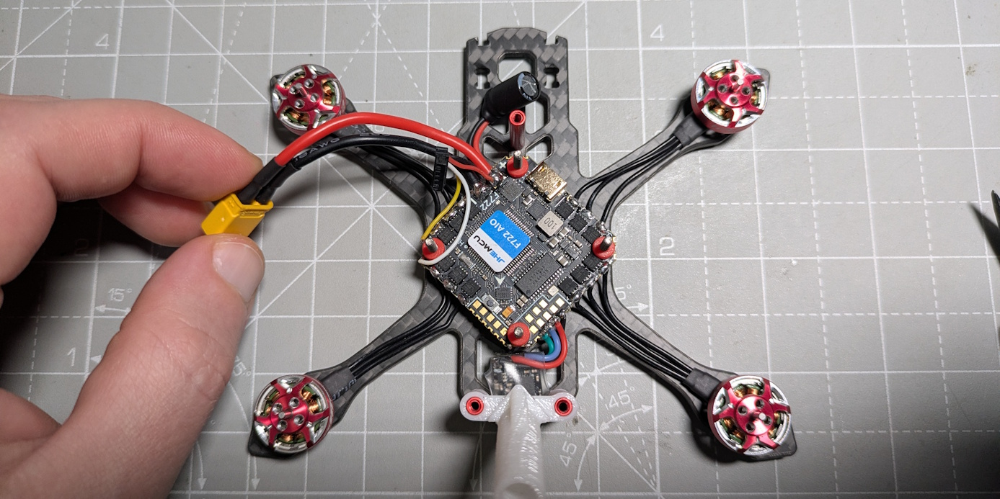

Having experienced many unreliable AiOs that didn’t meet the advertised specifications, we recommend opting for **proven hardware**.

Choosing an FC with an **integrated RX** can be a good option to save weight. When they feature a copper antenna, the range is generally quite limited. An **external RX** will often be a better option for range.

Those equipped with a flat antenna or, even better, a ceramic antenna, will offer a good balance of range while minimizing weight gain.

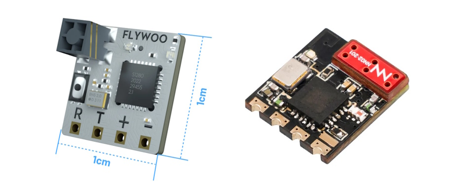

**Affordable and proven AiO recommendations :**

* **[JHEMCU GHF722AIO-HD 40A](https://fr.aliexpress.com/item/1005004940172936.html) :** almost overkill for a 2.5", but still a solid option with lots of positive feedback. We even use it on our 3.5" builds. However, you will need to add an external RX.

* **[JHEMCU GHF435AIO V2 20A](https://fr.aliexpress.com/item/1005007942847361.html) :** probably the perfect AiO for the JeNo Pocket. Its F435 is roughly equivalent to an F722, it is cheaper, and it also comes with an onboard RX! And this is a real RX, not an SPI receiver. It can therefore be used and flashed like a standalone RX. The cherry on top: it has a µ.FL connector, allowing you to use a proper antenna and therefore get maximum range. On this FC, the USB connector is vertical, so the **“X-Core” or “Tank”** version is required.

The **capacitor** is generally not required for 2S and 3S builds, but if you choose to use one, a **220 µF 25V** will do the job and can be placed either at the front standoff or at the back.

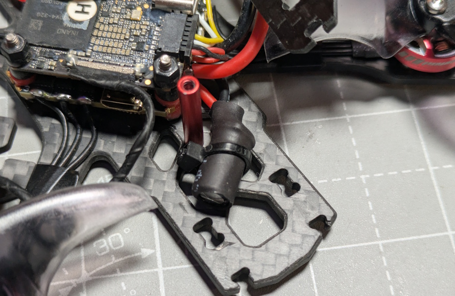

As for the **XT30** pigtail, **18 AWG** cable is a good compromise.

## Versions and files

### Versioning
You will find the **current version** of the frame at the beginning of the description and the full [history of modifications](#changelog) at the end of the page.

We strongly recommend always cutting the latest version to ensure you benefit from the most recent optimizations.

The version **number format** is as follows :
```
<Major versions>.<Minor version>.<Revision>
ex : 1.3.2
```

* **Revision :** This number is incremented in the case of minor modifications with no significant impact.
* **Minor version :** This number is incremented for minor modifications that may potentially break compatibility with certain TPU parts.
* **Major version :** This number is incremented for significant modifications that break compatibility at the carbon level.

**Note :** If you develop TPU parts for the JeNo, be sure to specify the version they are compatible with.

### Files management
To simplify things, we have reorganized the file structure. The files are now divided into **five groups** :

* **01-FRAME :** Contains **models** describing the **frame** in DXF, STEP, and STL formats for the current version. Also contains a PDF file which is a reformatted version of the DXF.
* **02-TPU :** Contains **TPU models** for the current frame version in STL format.
* **03-FRAME-HISTORY :** Contains previous versions of the frame.
* **04-TPU-HISTORY :** Contains TPU models that are no longer compatible with the current version.
* **OTHER-FILES :** Contains documentation files, including the assembly manual and a description.

## Get it cut !

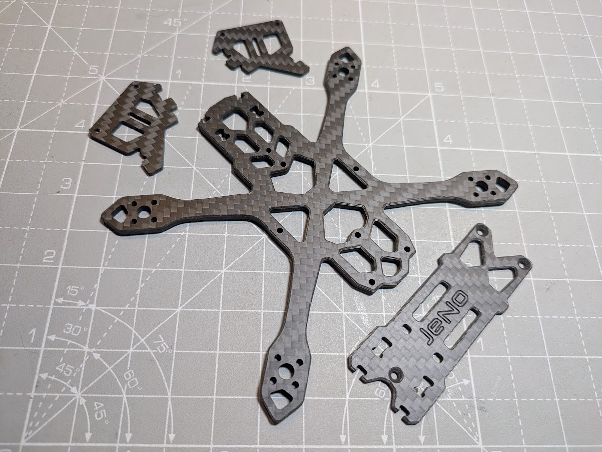

Unlike the 3 and 5" JeNos, the JeNo Pocket won't be available in shops.

The ["01-FRAME"](https://github.com/WE-are-FPV/JeNo-Pocket/tree/main/01-FRAME) folder contains all the files you need to get it **cut**. .DXF and .STEP files are available.

The bottom plate must be cut from 3 mm thick carbon fiber. The top plate and camera plates should be cut from 2 mm carbon fiber.

By default, we recommend adding **chamfers everywhere, except on the camera plates**.

**One last point :** carbon cutters generally use carbon sheets made of fiber layers oriented at 0° and 90°. To achieve the best arm stiffness, the bottom plate should be **oriented at 45°** during cutting. This is something they are usually very familiar with, but we prefer to mention it.

## Bill of materials

In addition to the carbon fiber, you will need the following hardware to complete the assembly of the frame.

**Standoffs**

Important note: M2 standoffs come in two diameters: 3.5 mm and 4 mm. **Make sure to use 3.5 mm diameter standoffs**.

| Quantity | Description | Details |
| :---: | :--- | :--- |
| **3** | **M2** standoffs, **3.5 mm diameter**. Available in 14, 16, 18 or 20 mm, depending on the selected bus height. | for the body |
| **2** | **M2x14mm** standoffs **(3.5 diameter)** | for the camera |

**Stack materials**

| Quantity | Description | Details |
| :---: | :--- | :--- |
| **4** | **M2x20mm** screws, depending on the selected bus height: 14 mm → M2x16, 16 mm → M2x18, 18 mm → M2x20, 20 mm → M2x20 | for the stack |
| **8** | **M2** nylon nuts for the stack screws (4 nuts for the base, 4 nuts on top) | for the stack |


**Frame materials**

| Quantity | Description | Details |
| :---: | :--- | :--- |
| **3** | M2x6 mm countersunk screws (titanium if possible) | for the top plate |
| **7** | **M2x6 mm** screws (titanium if possible) | for the bottom and camera plates |

**Additional materials**

| Quantity | Description | Details |
| :---: | :--- | :--- |
| **12-16** | **M2x5mm** screws if there is NO arm protection between the screw and the motor, otherwise, **M2x6mm**. To save **weight**, you can use only **2-3 screws per motor**. | for the motors |

## Building/Assembly guide

### Build
The assembly of the frame is straightforward :

<p align="center">
  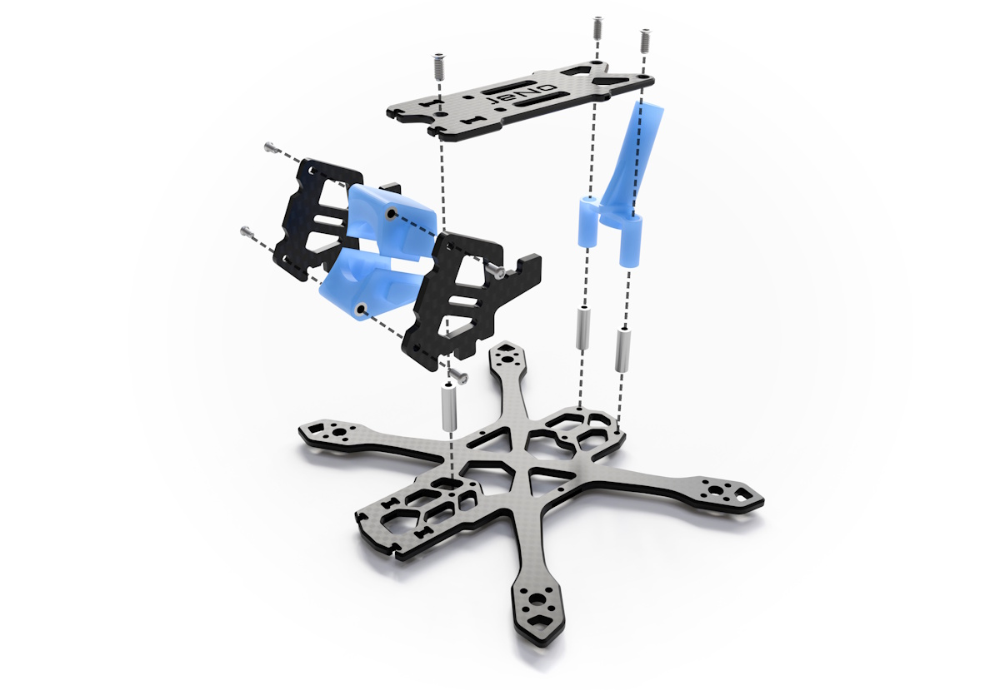
</p>

### Lipo mounting

Two areas are provided on the top plate, on each side of the logo, to stick two small LiPo pads if you want to use them. We recommend using 1.5 mm thick **LiPo pad** to keep the weight down.

**12–14 cm straps** will work very well for 2S and 3S LiPos from 450 to 560 mAh. Note that the top plate now includes dedicated strap slots.

Finally, **two small holes** on the top plate allow you to **secure the pigtail** with a **zip tie** in case the LiPo gets ripped off:

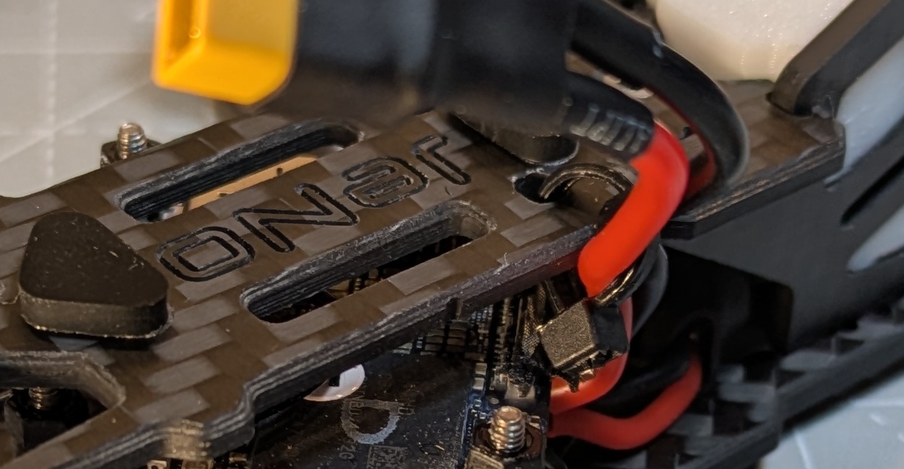

## Inspiration

The **JeNo Pocket** was initially inspired by its two bigger brothers, the JeNo 3" and 5".

**The rear stack is gone**, as it is no longer needed with the DJI O4 Lite Air Unit. The front section, made of two camera plates, was designed around the O4 Lite camera and its lens mods.

Although the V2 has been completely redesigned, it draws inspiration from [Cam.Traveler](https://www.printables.com/model/1236609-jeno-25-drone-frame-jeno-pocket-custom)’s [JeNo 25](https://www.printables.com/model/1236609-jeno-25-drone-frame-jeno-pocket-custom), which itself was inspired by the [JeNo Pocket](https://github.com/WE-are-FPV/JeNo-Pocket) and [JeNo Fit 3"](https://github.com/WE-are-FPV/JeNo-Fit-3-3.5).

## Tuning, Betaflight Preset

**No built-in preset** for now. AiO behavior can vary quite a lot from one board to another, so we’ll wait until we have more feedback.

However, here is an overview of the first tune used for our test flights, which you can use as a starting point **if your Blackbox logs are clean enough**. Note that we enabled profile switching based on the LiPo cell count.

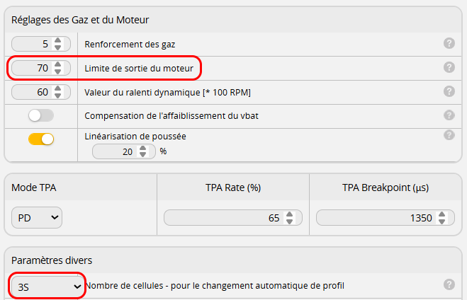

As always, **be very careful** when applying these settings.

**PID profile for 2S :**

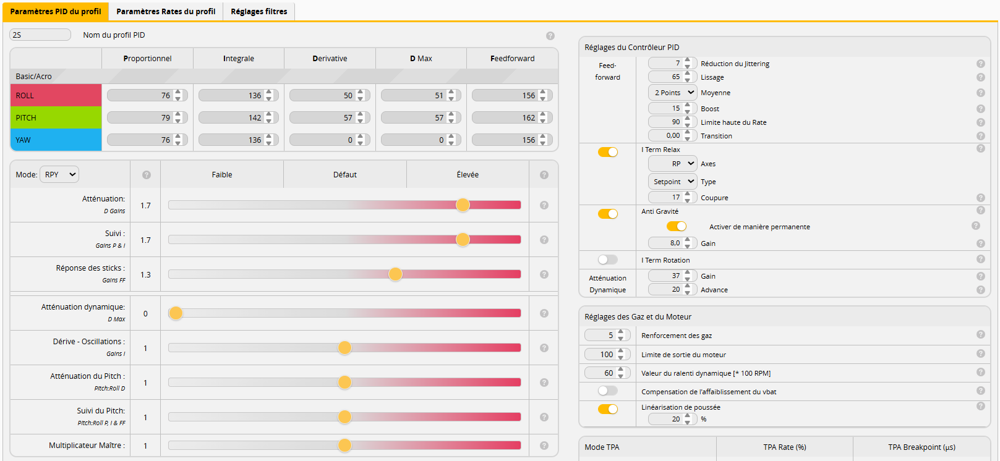

**PID profile for 3S (8000KV motors limited to 70-75%):**

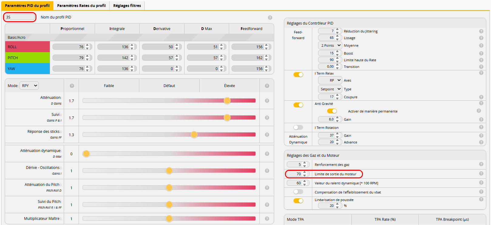

**Filters :**

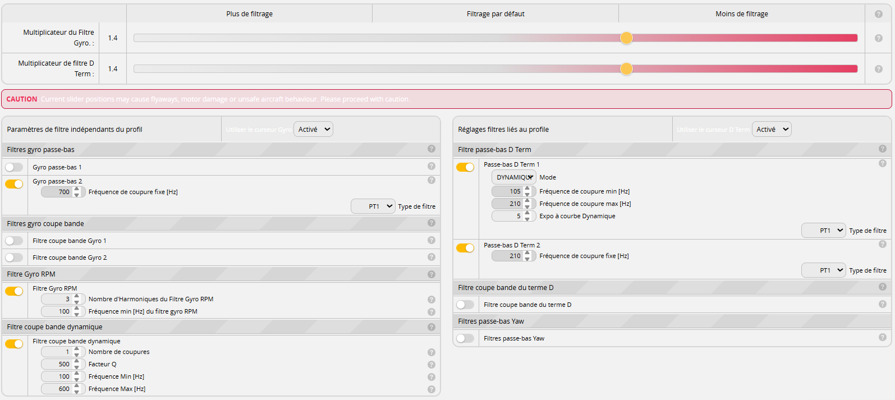

## Blackbox

Here is an overview of the vibration distribution across all 3 axes on the JeNo Pocket V2 Classic. This is the **unfiltered** gyro signal from a tuning flight with Gemfan 2520-3 props:

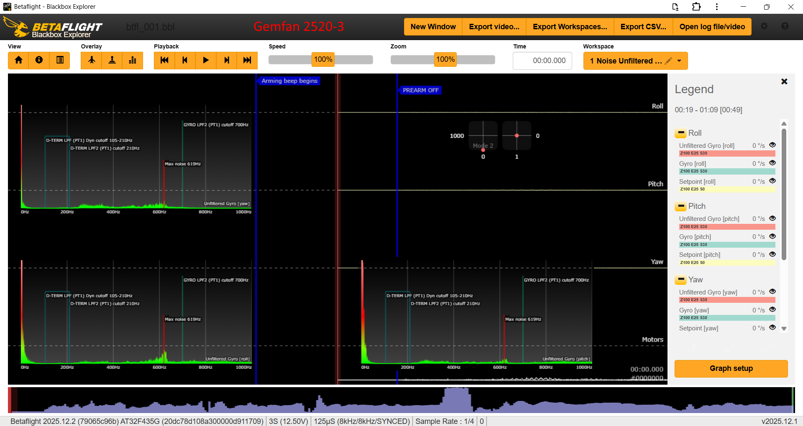


## Videos
Presentation of the **JeNo Pocket V2** on the **WE are FPV** channel :

[](https://www.youtube.com/watch?v=WM7FAgx-Zp0 "JeNo Pocket review on WE are FPV (French) - Click to Watch!")

Demonstration of the **JeNo Pocket's capabilities** :

[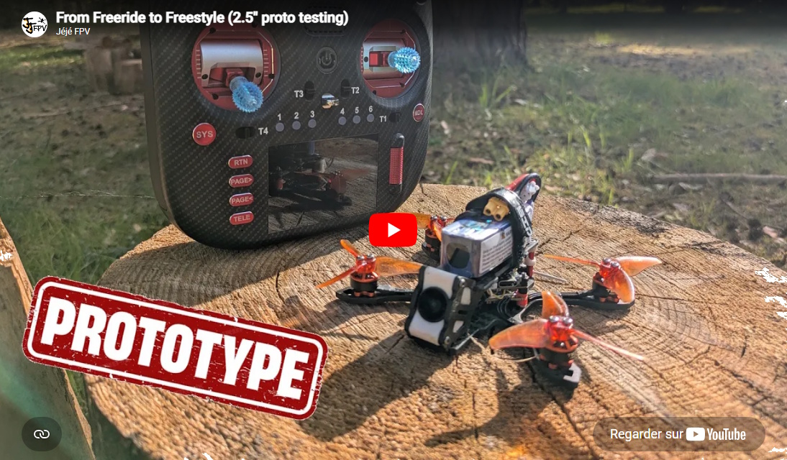](https://www.youtube.com/watch?v=INSy-MZBwRk "JeNo Pocket V2 Freeride to Freestyle - Click to Watch!")

## Builds examples

You can find many build examples on [WE are FPV's DroneBuilds](https://forum.wearefpv.fr/71-dronebuilds/) and [RotorBuilds](https://rotorbuilds.com) :

* fr : [JeNo Pocket V2 Low Cost](https://forum.wearefpv.fr/topic/26226-jeno-pocket-v2-low-cost/) (by Jéjé FPV)
* fr : [JeNo Pocket V2 Premium)](https://forum.wearefpv.fr/topic/26227-jeno-pocket-v2-premium/) (by Jéjé FPV)
* ...

Find numerous examples of builds on the _**DroneBuilds**_ page of WE are FPV.
[](https://forum.wearefpv.fr/71-dronebuilds/ "DroneBuilds - Click to Access!")

## Authors

The JeNo Pocket V2 was designed by :

* nochamo - [Youtube](https://www.youtube.com/user/nochamo)
* Jerome / Jéjé FPV - [Youtube](https://www.youtube.com/@jejefpv)
* Cam.Traveler


## TPU

Among the downloadable files, you will find several TPU parts for your JeNo Pocket V2:

* Camera TPU mounts — O4 Lite, O4 with O3 Lens Mod, and O4 Wide
* VTX antenna mounts
* Arm guards
* Rear bumper

## Community (remixes and TPU)

**Fork/remix**

If something about the JeNo Pocket V2 does not suit you 100%, feel free to take a look at the community remixes — you might find exactly what you need there:

Coming soon...

**TPU**

Coming soon...

## Changelog

> [!TIP]
> Compatibility is consistently maintained between each version: if your frame was a v1, the parts from v1.2 will be compatible. The same applies to TPU accessories. That's why we don't keep the history of previous versions.

* Version **2.0.0** (01/06/2026) :
  * Release of the JeNo Pocket V2

## Join the JeNo family !

|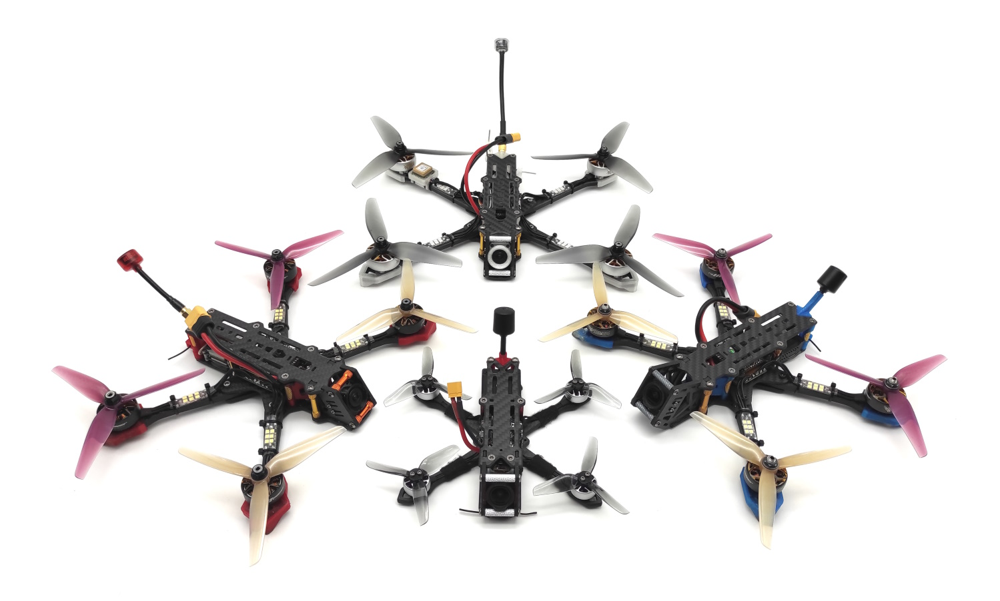|
|:---:|
| JeNo Classic Modus (left), JeNo Cine (right), JeNo 6" (top), JeNo 3" (bottom) |